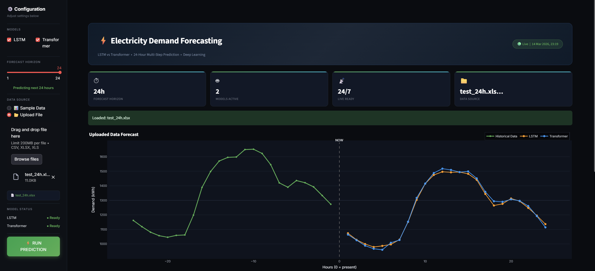
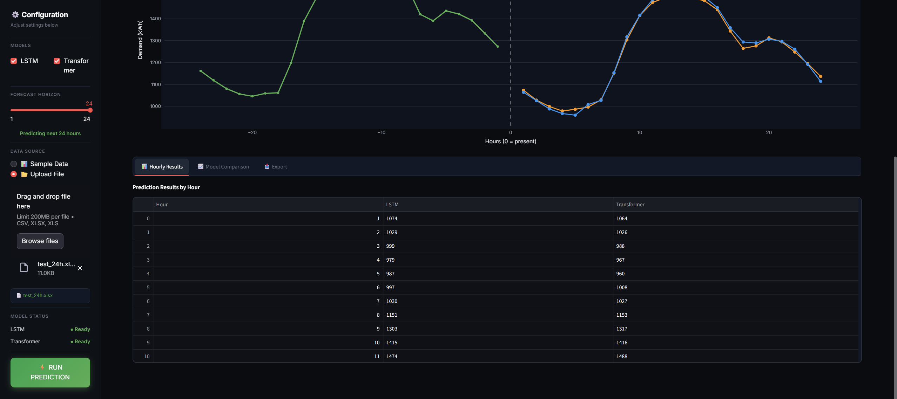
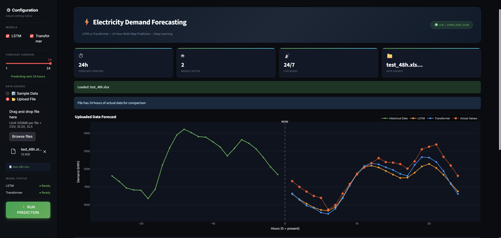
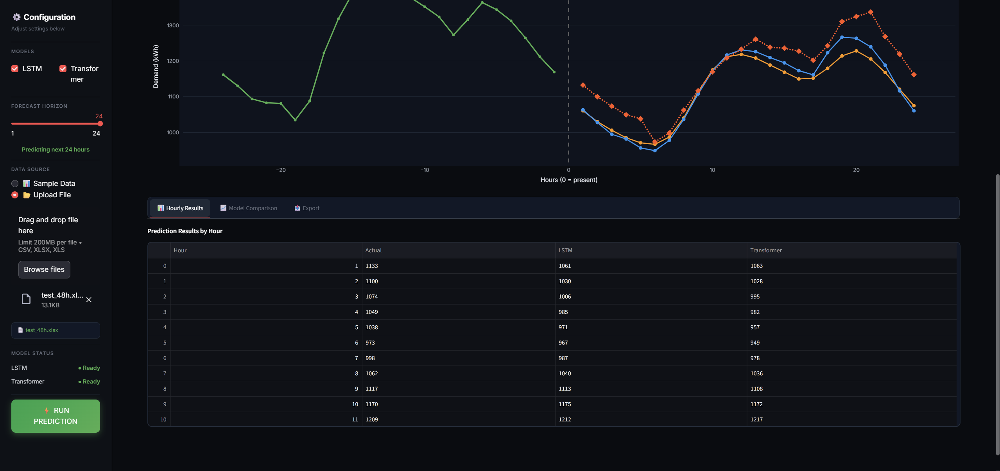
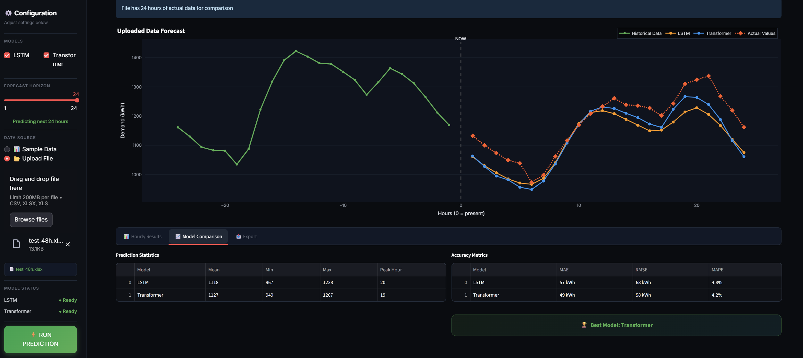

# Electricity Load Forecasting using LSTM and Transformer

## Overview
Electricity demand forecasting is an important task in power system planning, energy management, and grid stability. Accurate predictions help optimize electricity generation and distribution.

This project explores deep learning approaches for electricity load forecasting by implementing and comparing two sequence models:

- LSTM (Long Short-Term Memory)
- Transformer

The objective is to evaluate how well these models capture temporal patterns in electricity consumption data.

---

## Dataset
This project uses the Electricity Load Forecasting dataset containing historical electricity consumption records over time.

The dataset includes:

- Time-series electricity load data
- Historical demand patterns
- Temporal information related to electricity consumption

Before training, the dataset was preprocessed and transformed into time sequences suitable for deep learning models.

---

## Models

### LSTM
Long Short-Term Memory (LSTM) is a type of Recurrent Neural Network designed to learn long-term dependencies in sequential data. It uses memory cells and gating mechanisms to capture temporal relationships in time-series data.

### Transformer
The Transformer architecture uses self-attention mechanisms to model relationships between different time steps. It allows the model to capture global dependencies and process sequences more efficiently compared to traditional recurrent models.

---

## Evaluation Metrics

The models were evaluated using the following metrics:

| Metric | Description |
|------|------|
| RMSE | Root Mean Squared Error |
| MAE | Mean Absolute Error |
| R² | Coefficient of Determination |

---

## Model Performance

| Metric | LSTM | Transformer |
|------|------|------|
| RMSE | 98.13 | 100.52 |
| MAE | 74.44 | 75.64 |
| R² Score | 0.7306 | 0.7173 |

### Result Analysis
The LSTM model slightly outperformed the Transformer model on this dataset. LSTM achieved lower prediction errors (RMSE and MAE) and a higher R² score. This suggests that LSTM captures the temporal patterns in the electricity load dataset more effectively under the current configuration.

---
## Demo

To demonstrate the model performance, two test scenarios were conducted using different forecasting horizons.

### Test Case 1: 24-Hour Forecast
In this test, the model predicts electricity demand for the next **24 hours**.  
Since the prediction horizon is in the future, **actual ground truth values are not available** for comparison.

Results are illustrated in the following figures:

These figures show the predicted electricity load generated by the trained models.

---

### Test Case 2: 48-Hour Forecast
In this scenario, the model predicts electricity demand for **48 hours**, where **actual electricity load values are available**.  
This allows direct comparison between predicted values and real observations.

Results are shown in the following figures:

These figures compare the **predicted electricity load with the actual load**, illustrating the forecasting accuracy of the models.
---
## Log wandb
https://wandb.ai/tuankiet1302051-fpt-university/electricity-demand-prediction/reports/Electricity-Forecasting--VmlldzoxNjIwNTk5Mw?accessToken=o570k9hr2zirgszstiz8lz6hlirev7p3myy3861czagidzm9ml30avqyb8bhappb
